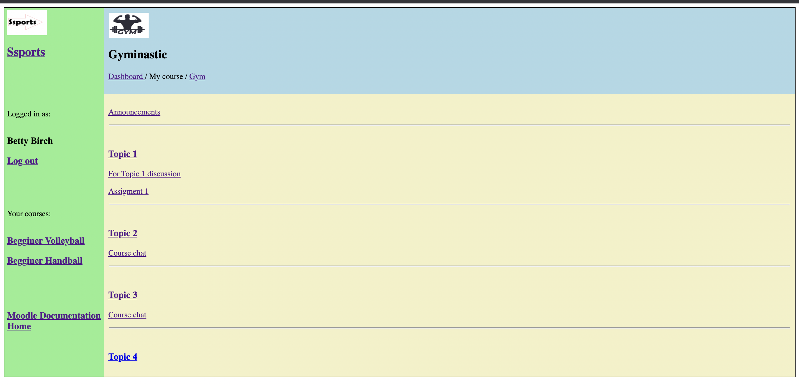

# Online Course Interface Design

This project simulates a basic course interface for an online gym training platform. It was created as part of a university assignment to practice web design using HTML and CSS.

## 📘 Course Context
This assignment was part of the [insert course name, e.g., Web Development Fundamentals] course from the Bachelor of Information Sciences – Major in Data Science at Massey University.

## 🧠 Project Description
The interface includes:
- A sidebar with user login, logout, and course links.
- A main content area with sections for announcements and multiple course topics.
- External resources like Moodle documentation.
- Usage of images and links for realistic interaction.

The layout was created using **HTML5** and **custom CSS**, without JavaScript.

## 🧰 Technologies Used
- HTML
- CSS

## 📁 Repository Structure

- `assi2.html` – Main HTML file
- `assi2.css` – Custom styles
- `ssports.png` – Sidebar logo
- `gym.png` – Header image for Gym course
- `assi2.png` – Screenshot of the rendered page 
- `README.md` – Project documentation

## 🖥️ Preview

You can view the screenshot below for a visual representation:

## ▶️ How to View Locally
1. Clone or download the repository.
2. Open the file `assi2.html` in your web browser.
3. Make sure all image files are in the same directory for full visual rendering.

## 📌 Notes
- Some external links point to Moodle resources used in the original assignment context.
- This project is for educational purposes only.
